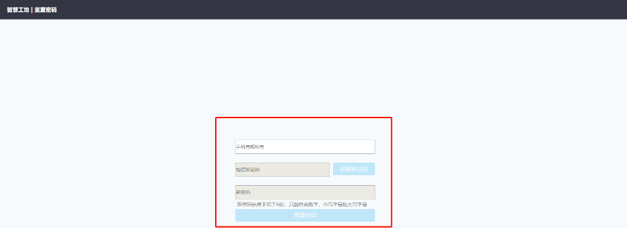

# 操作手册

## 1 说明

### 1.1 操作手册符号

- 符号说明：【 】表示功能模块，[ ]表示模块中按钮，“ ”表示条目名称

- 产品设计通用性说明：

  - a） 对模块本身进行的编辑、删除、其他操作，按钮均在界面右上角。
  - b）对模块中的内容进行的编辑、删除、其他操作，均在模块中工具栏内。

  

## 2 操作流程

### 2.1 第一部分：系统登陆配置

#### 2.1.1 系统登陆配置

- a)  建议使用浏览器：谷歌浏览器
- b)  系统登录网址： https://xxxx.mctech.vip/
- c)  系统登录账号：个人手机号
- d)  系统登录密码：手机验证码登录或设置的固定密码
- e)  修改密码：短信验证码登录系统后点击右上角用户头像，下拉列表选择【修改密码】，在重置密码页输入相关信息设置新固定密码；

- f)  账户添加：【基础数据管理】→【组织管理】→[组织用户] → [选择添加用户]旁边下拉三角符号 →[创建新用户] →输入“手机号”、“用户姓名”、“性别”→[确定]；（仅本项目系统管理员有权限）；

  

  

- g) 角色设置：【基础数据管理】→【组织管理】→[组织用户] →具体用户信息行[设置角色] →[生产进度管理]/[基础数据管理] →勾选角色；

- h) 从系统管理进入生产进度管理界面：点击用户姓名→[切换产品]→【生产进度管理】;

#### 2.2.2 工具端登录

这里放个视频演示示例

<video id="video" controls="" preload="none" poster="./cq/videos/8.jpg" style="max-width: 100%">
  <source id="mp4" src="./cq/videos/8.mp4" type="video/mp4">
</video>
